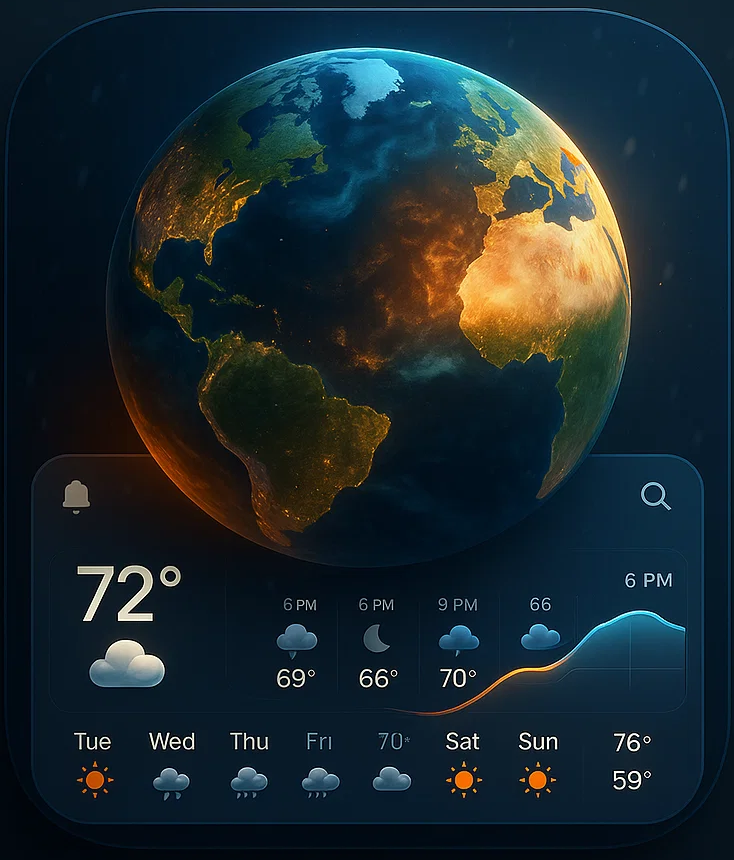

<p align="center">
  
</p>

<h1 align="center">WeatherWatch</h1>

<p align="center">
  A cinematic, globe-based weather experience powered by real-time data
</p>

<p align="center">
  
  
  
  
</p>

---

## 🌍 Overview

**WeatherWatch** is an immersive weather application that visualizes real-time conditions across the globe using an interactive 3D Earth.

It blends **accurate forecasts**, **cinematic UI**, and **smooth spatial navigation** to turn weather data into an experience — not just numbers.

---

## ✨ Features

- 🛰️ **Interactive 3D Globe**
  - Click anywhere on Earth to fetch live weather
  - Smooth camera fly-to transitions
  - Active coordinate tracking

- 🌗 **Day / Night System**
  - Automatically synced with real-world daylight
  - Manual override with animated transitions
  - Night-side Earth lighting

- 🌦️ **Dynamic Atmosphere**
  - Atmosphere color adapts to weather conditions
  - Clouds, rain, mist, snow, storms reflected visually

- 📊 **Forecast Timeline**
  - 7-day overview
  - Click days to drill into hourly temperatures
  - Smooth animated transitions

- 🔍 **Smart Location Search**
  - Live city search with autocomplete
  - Instant globe navigation on selection

- 🎥 **Cinematic Backgrounds**
  - Weather-reactive video backgrounds
  - Smooth crossfades on condition changes

---

## 🧠 Tech Stack

- **React**
- **react-globe.gl**
- **Framer Motion**
- **Tailwind CSS**
- **WeatherAPI**
- **react-hot-toast**

---

## 🚀 Getting Started

```bash
git clone https://github.com/your-username/weatherwatch.git
cd weatherwatch
npm install
npm run dev
